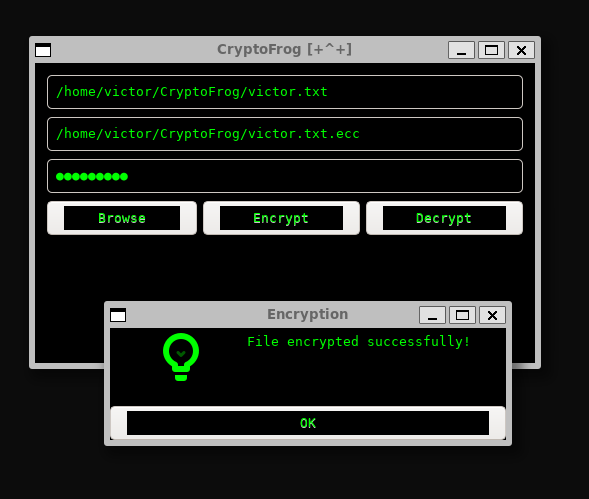

# CryptoFrog 🐸🔐


## Overview

   

**CryptoFrog** is a robust, secure, and user-friendly encryption application developed for Linux Ubuntu. Built with modern C++20 standards, CryptoFrog utilizes a custom elliptic curve (**ECCFrog512CK2**) alongside powerful cryptographic algorithms such as **AES-GCM-256** and **Argon2ID** for secure, reliable, and efficient file encryption and decryption. Its graphical interface is powered by **GTK3**, offering a sleek, retro-inspired hacker aesthetic.

CryptoFrog extends the concept from its predecessor project, [**OpenFrogget**](https://github.com/victormeloasm/OpenFrogget), introducing enhanced security, an improved user interface, and more efficient encryption methods.

---

## Table of Contents

1. [Features](#features)
2. [Screenshots](#screenshots)
3. [Installation](#installation)
   - [Dependencies](#dependencies)
   - [Building from Source](#building-from-source)
4. [Usage](#usage)
   - [Encrypting Files](#encrypting-files)
   - [Decrypting Files](#decrypting-files)
5. [Technical Details](#technical-details)
   - [Encryption Method](#encryption-method)
   - [Custom Elliptic Curve](#custom-elliptic-curve)
   - [Compression with UPX](#compression-with-upx)
6. [Project Structure](#project-structure)
7. [License](#license)

---

## Features

- **Hybrid Encryption:** Combines custom elliptic curve cryptography (**ECCFrog512CK2**) with **AES-GCM-256** symmetric encryption.
- **Secure Key Derivation:** Utilizes **Argon2ID**, winner of the Password Hashing Competition, for secure key generation.
- **User-Friendly GUI:** Sleek, intuitive GTK3 interface.
- **Efficient:** Optimized binary using UPX compression.
- **Retro Hacker Aesthetic:** Unique user interface inspired by classic hacking tools.

---

## Screenshots



---

## Installation

### Dependencies

CryptoFrog requires several libraries and tools. Ensure you have the following installed:

- **C++20 Compiler** (g++)
- **GTK3 Development Libraries**
- **libsodium** (Cryptographic library)
- **GMP** (GNU Multi-Precision Arithmetic Library)
- **UPX** (Ultimate Packer for eXecutables)

Install dependencies using the provided script:

```bash
sudo apt update
sudo apt install -y g++ libgtk-3-dev libsodium-dev libgmp-dev upx
```

### Building from Source

Clone this repository and navigate into the directory:

```bash
git clone https://github.com/yourusername/cryptofrog.git
cd cryptofrog
```

Compile the project using Make:

```bash
make
```

Upon successful compilation, the binary will be located in the `build/` directory.

---

## Usage

Run CryptoFrog using the following command:

```bash
./build/cryptofrog
```

### Encrypting Files

1. Open CryptoFrog.
2. Select the file you wish to encrypt using the "Choose File" button.
3. Enter a strong password in the provided input field.
4. Click "Encrypt". CryptoFrog will output an encrypted file with the `.ecc` extension in the same directory.

### Decrypting Files

1. Select an encrypted file (with `.ecc` extension).
2. Enter the password used for encryption.
3. Click "Decrypt". CryptoFrog will decrypt the file, restoring the original contents.

---

## Technical Details

### Encryption Method

CryptoFrog uses a hybrid encryption method:

- **ECCFrog512CK2**: Custom elliptic curve cryptography for secure key exchange.
- **AES-GCM-256**: Advanced Encryption Standard in Galois/Counter Mode for symmetric encryption.
- **Argon2ID**: Secure key derivation from user passwords.

### Custom Elliptic Curve

**ECCFrog512CK2** is a custom-developed elliptic curve designed for high security, rigorously tested to resist known vulnerabilities. This curve represents a substantial upgrade from its predecessor implemented in [OpenFrogget](https://github.com/victormeloasm/OpenFrogget).

### Compression with UPX

The final binary is compressed using **UPX**, reducing the file size significantly without compromising execution speed or security.

---

## Project Structure

```plaintext
cryptofrog/
├── assets/
│   ├── crypto.png     (Logo)
│   └── print.png      (Screenshot)
├── build/             (Compiled binary location)
├── data/              (Test files)
├── src/               (Source code)
│   ├── main.cpp
│   ├── encrypt.cpp
│   ├── decrypt.cpp
│   ├── eccfrog512ck2.cpp
│   ├── splash.cpp
│   └── utils.h
├── Makefile
└── README.md
```

---

## License

CryptoFrog is released under the GNU General Public License v3.0.

```
Copyright (C) 2025 Your Name

This program is free software: you can redistribute it and/or modify
it under the terms of the GNU General Public License as published by
the Free Software Foundation, either version 3 of the License, or
(at your option) any later version.

This program is distributed in the hope that it will be useful,
but WITHOUT ANY WARRANTY; without even the implied warranty of
MERCHANTABILITY or FITNESS FOR A PARTICULAR PURPOSE.  See the
GNU General Public License for more details.

You should have received a copy of the GNU General Public License
along with this program.  If not, see <https://www.gnu.org/licenses/>.
```

---

## Acknowledgments

Inspired by and based upon the initial work done in [OpenFrogget](https://github.com/victormeloasm/OpenFrogget). Special thanks to the open-source community for the incredible tools and libraries used in CryptoFrog.

